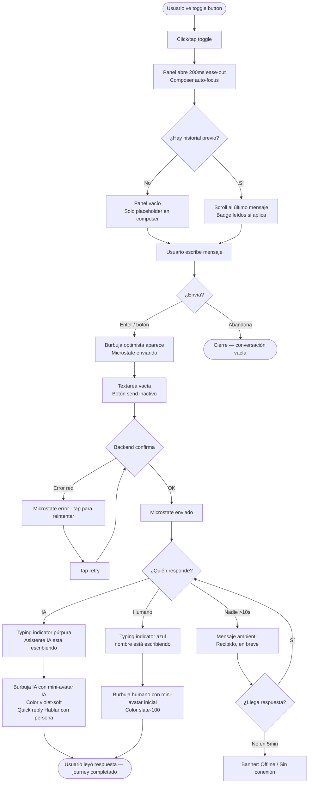
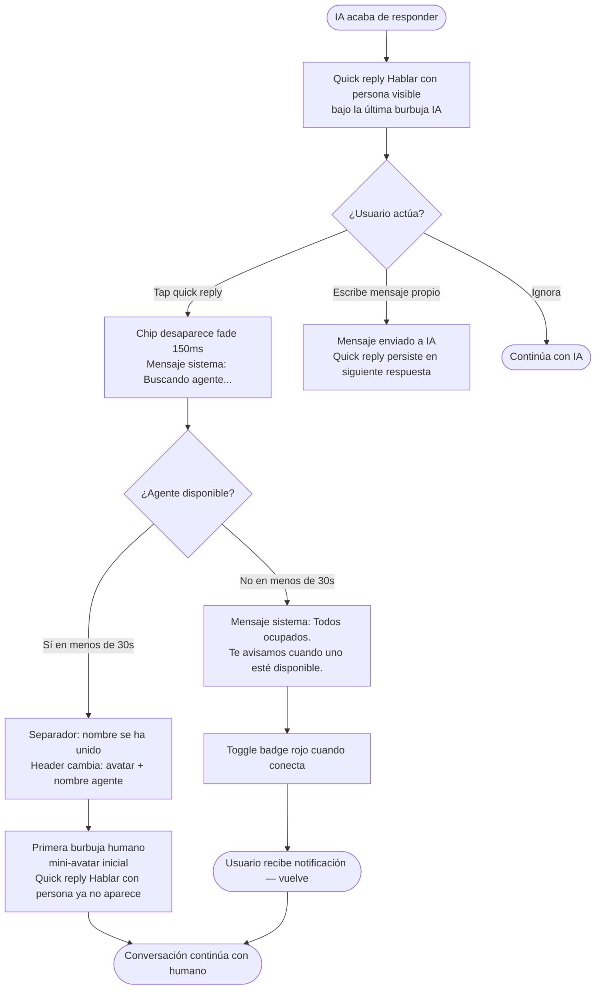
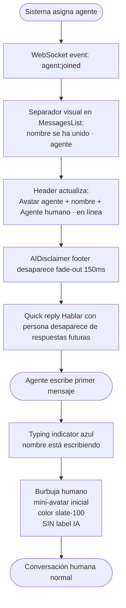
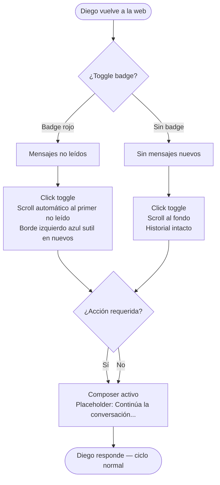
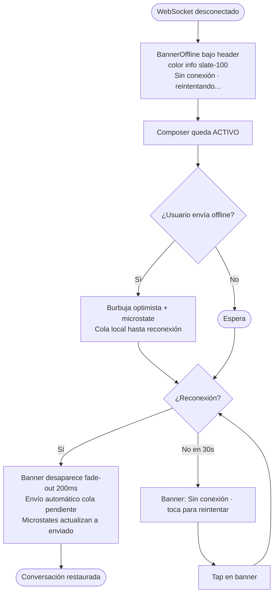

# Especificación de Diseño UX — guiders-sdk Chat Widget

**Autora:** Sally (UX Designer)
**Stakeholder:** Roger
**Fecha:** 2026-05-04
**Alcance:** Rediseño visual del chat widget (Preact-based) sin modificar arquitectura ni signals

---

## Executive Summary

### Project Vision

guiders-sdk es un SDK JavaScript embebible en webs B2B/e-commerce que ofrece chat en tiempo real entre visitantes anónimos y comerciales humanos. El rediseño UX busca elevar el chat widget de "componente genérico" a producto percibido como pulido, profesional y de marca, manteniendo la arquitectura Preact + Signals ya migrada y los 12/12 tests E2E en verde.

### Target Users

**Primaria — Sara (visitante final del cliente del SDK):** 34 años, compradora indecisa navegando desde mobile. Llega al chat porque NO SABE QUÉ PEDIR (no porque no encuentre algo). Necesita señales visibles de presencia humana ("María está conectada"), continuidad cuando vuelve, y que el composer no se rompa cuando aparece el teclado mobile o llega un mensaje entrante. **Necesita saber inequívocamente si quien le responde es una persona o una IA** — sin ambigüedad ni en el header, ni en cada mensaje, ni en los tiempos de respuesta.

**Secundaria — Marcos (cliente del SDK):** 41 años, CTO de pyme evaluando integrar Guiders. Evalúa con DevTools abierto: bundle size, async loading, CSP, dark mode del SO, RTL. Decide en conjunto con su diseñador, que vetará si rompe su design system. Necesita sistema de tokens amplio (color + tipografía + radius + spacing + dark mode), no solo "1 color override". **También necesita configurar visualmente el comportamiento IA/humano**: poder definir el nombre del asistente IA, su avatar, el copy del disclaimer legal, y los flows de handoff a humano.

**Terciaria — Diego (visitante recurrente):** 28 años, vuelve 2 días después a continuar una conversación previa. Necesita ver su historial al abrir el chat ("María: ¿conseguiste decidirte?"). Sin esto, se siente anónimo y la confianza construida ayer se pierde.

### Key Design Challenges

1. Falta de identidad visual coherente con la marca de la web del cliente
2. Aprovechamiento pobre del viewport mobile (vacíos masivos)
3. Banner offline agresivo que merma confianza desde el primer segundo
4. Sin diferenciación visual entre roles de mensaje, sin metadatos visibles
5. Composer y quick actions sin jerarquía clara
6. Toggle button con accidentes visuales (borde rainbow no intencional)
7. Sin indicador de presencia humana ("María conectada") — el visitante no sabe si hay alguien real antes de escribir
8. Composer mobile bloqueado por teclado virtual: el último mensaje recibido queda oculto cuando el visitante está escribiendo
9. Sin continuidad visible para visitantes recurrentes — al reabrir el chat en otra sesión no se muestra el historial anterior
10. **Sin distinción visual entre respuestas de IA y de humano** — riesgo de confusión, pérdida de confianza si el visitante descubre que "María" era una IA, e **incumplimiento del EU AI Act Art. 50** (vigente desde agosto 2026) que obliga a informar de forma clara y distinguible cuando se interactúa con un sistema de IA
11. **Sin transición visual clara en el handoff IA → humano** — cuando una IA traspasa la conversación a un comercial real, el visitante puede no notar el cambio, generando expectativas erróneas sobre tiempos de respuesta y capacidades

### Design Opportunities

1. **Bottom sheet mobile** en vez de fullscreen → patrón nativo familiar
2. **Header con avatar + presencia** → confianza inmediata
3. **Sistema de tokens CSS** (`--guiders-primary`, `--guiders-radius`, etc.) → personalización 1-token por cada cliente del SDK
4. **Microinteracciones con propósito** → typing indicator, transiciones suaves, scroll behavior
5. **Empty states cálidos** con ilustración SVG y copy invitante
6. **Estados de mensaje completos** → enviando / enviado / leído / fallido
7. **Indicador de presencia explícito en header** — "María · activo ahora", "Equipo conectado", "Responderemos en X min" según contexto
8. **Composer mobile sticky con visual viewport API** — el composer se ancla encima del teclado y el último mensaje siempre permanece visible
9. **Sistema de tokens amplio**: color, tipografía, radius, spacing, dark mode auto-detect (`prefers-color-scheme`), RTL support — vendible a Marcos
10. **Persistencia visible de historial** — al abrir el chat, mostrar conversación anterior con separador "Ayer" / "Hace 2 días"
11. **Sistema de identidad de autor con 3 tipos visualmente inequívocos**: visitante, humano, IA. Cada mensaje IA lleva badge persistente "Asistente IA" + icono distintivo + variante cromática diferenciada. El header muestra el tipo de interlocutor activo en todo momento
12. **Disclaimer IA al inicio de cada conversación nueva con IA** — banner discreto pero visible: "Estás chateando con [Asistente Guiders], un asistente de IA. Puedes pedir hablar con una persona en cualquier momento." Cumple EU AI Act Art. 50
13. **Handoff IA → humano con separador visual claro en el hilo** — divisor con copy "Te atiende ahora María, una persona del equipo" + cambio del header (avatar, nombre, badge). El visitante nunca duda de a quién le habla

---

## Core User Experience

### Defining Experience

La acción central del usuario es **enviar un mensaje y recibir respuesta percibiendo presencia humana o IA inequívocamente identificada al otro lado, sin perder contexto de la web ni del teclado**. Todo el rediseño se subordina a este ciclo. Si este flow es perfecto, Sara compra, Marcos firma y Diego vuelve. Si falla — especialmente si Sara cree hablar con humano cuando es IA — ninguna microinteracción visual lo compensa y se incurre en incumplimiento legal.

### Platform Strategy

- **Tipo:** widget JS embebido en webs de terceros (constraint SDK)
- **Aislamiento:** Shadow DOM existente, no se modifica
- **Mobile-first** con un solo breakpoint en `640px`:
  - `< 640px`: bottom sheet anclado abajo, alto `min(85vh, 640px)`
  - `≥ 640px`: panel flotante esquina, `400×600px`
- **Capacidades device requeridas:**
  - `window.visualViewport` API → composer ancla sobre teclado mobile
  - `prefers-color-scheme` → dark mode auto-detect
  - `prefers-reduced-motion` → desactiva animaciones no esenciales
- **Offline:** muestra estado pero no es funcional sin WebSocket vivo
- **Constraint técnico:** bundle ≤ 450 KiB total, ≤ +10 KB del refinamiento
- **Constraint legal:** EU AI Act Art. 50 (Reglamento UE 2024/1689) obliga a informar de forma clara, distinguible y oportuna cuando el usuario interactúa con un sistema de IA. Aplicable desde agosto 2026.

### Effortless Interactions

| Interacción | Comportamiento esperado |
|-------------|------------------------|
| Abrir el chat | Transición 200ms desde el toggle al panel |
| Escribir en mobile | Composer ancla con Visual Viewport API, último mensaje visible |
| Recibir mensaje mientras escribo | Mensaje arriba, input intocado, scroll suave |
| Saber si hay alguien | Avatar + estado "María · activo · responde en ~2 min" |
| Volver al chat al día siguiente | Historial visible con separador "Ayer" / "Hace 2 días" |
| Cerrar y reabrir en misma sesión | Estado siempre persistente |
| Enviar mensaje | Microestados visibles: enviando → enviado → leído |
| **Saber si me responde IA o humano** | Header + cada burbuja muestran tipo (badge "IA" o nombre humano + avatar) sin necesidad de leer el contenido |
| **Pedir hablar con una persona** | Quick action siempre visible cuando el interlocutor activo es IA, ejecuta handoff con feedback visible |

### Critical Success Moments

1. **Primer vistazo (5s):** presencia (humana o IA) claramente identificada + UI pulida → confianza
2. **Primer mensaje enviado (10s):** typing indicator + feedback inmediato → engagement
3. **Marcos en DevTools:** overhead <50KB, async, sin errores CSP → evaluación positiva
4. **Diego vuelve 2 días después:** historial visible → fidelización
5. **Sara descubre que era IA mid-conversación (worst case):** si en cualquier punto Sara descubre que "María" era una IA y NO se le había avisado → pérdida total de confianza, posible queja AEPD/AI Act, daño reputacional al cliente del SDK. **Make-or-break absoluto:** la transparencia IA debe ser tan visible que sea **imposible** que el visitante crea hablar con humano cuando es IA.

### Experience Principles

- **P7. Transparencia IA inequívoca, siempre.** Si una IA responde, el visitante lo sabe en cada mensaje, en el header y en el primer contacto. Nunca se simula humanidad. Nunca se omite el disclaimer. El handoff IA→humano (o viceversa) tiene separador visual obligatorio. **Esto no es preferencia de diseño, es cumplimiento legal (EU AI Act Art. 50, vigente desde agosto 2026).**
- **P1. Presencia humana o IA, claramente identificada antes que decoración.** Cada elemento responde primero a "¿esto comunica QUIÉN está al otro lado (humano específico o IA específica)?" antes que a "¿esto es bonito?".
- **P2. El composer es sagrado.** Lo que el usuario escribe nunca se pierde, nunca queda tapado, nunca pierde foco.
- **P3. Feedback en cada acción de <100ms.** Aunque el servidor tarde, el UI reconoce la acción en menos de 100ms.
- **P4. Mobile no es desktop encogido.** Bottom sheet, viewport-aware, gestos nativos. El widget se siente parte del SO.
- **P5. Personalizable sin programar.** Cliente del SDK cambia tokens CSS y todo se adapta — sin tocar JS, sin recompilar.
- **P6. Continuidad sobre novedad.** Visitante recurrente siente que el negocio le recuerda, no que es uno más.

---

## Desired Emotional Response

### Primary Emotional Goals

**Sara (visitante):** "Atendida" — sentirse vista, escuchada y comprendida por alguien (humano o IA, claramente identificado) que va a ayudarla.

**Marcos (cliente SDK):** "Tranquilo" — confianza técnica de que esto no va a romper nada en su web ni le va a meter en un lío legal.

**Diego (recurrente):** "Reconocido" — el negocio le recuerda como persona.

**Diferenciador frente a competencia:** mientras Intercom/Drift/Crisp diseñan para "delight" o "speed", guiders-sdk diseña para **honestidad sentida**. En la era del chatbot IA agresivo, esta es nuestra ventaja reputacional sostenible.

### Emotional Journey Mapping

| Momento | Emoción deseada | Emoción a evitar |
|---------|----------------|------------------|
| Veo el toggle | Curiosidad invitada | Intrusión |
| Abro el chat | Esperanza | Decepción |
| Veo "Asistente IA" | Claridad | Engaño |
| Veo "María · activo" | Confianza humana | Sospecha de bot |
| Escribo primer mensaje | Valentía | Ansiedad |
| Typing indicator | Anticipación calmada | Impaciencia |
| Respuesta útil | Alivio + gratitud | Frustración |
| Pido pasar a humano | Control | Atrapamiento |
| Handoff completado | Continuidad | Repetición |
| Decisión tomada | Logro tranquilo | Arrepentimiento |
| Vuelvo al día siguiente | Familiaridad | Anonimato |
| Algo falla | Información clara | Pánico |

### Micro-Emotions

Las 6 batallas emocionales críticas:
- **Confianza vs Sospecha** — si Sara sospecha que "María" es IA, todo cae
- **Claridad vs Confusión** — cada elemento tiene un solo significado
- **Calma vs Ansiedad** — composer roto en mobile genera ansiedad real
- **Control vs Atrapamiento** — escalado a humano siempre disponible
- **Pertenencia vs Anonimato** — Diego debe sentir que le recuerdan
- **Honestidad vs Engaño** — transparencia IA inequívoca (crítico legal)

### Design Implications

| Emoción objetivo | Decisiones UX |
|------------------|---------------|
| Confianza | Avatar real, nombre completo, presencia verde, badge tipo visible |
| Calma | Animaciones <300ms `ease-out`, sin movimientos bruscos |
| Claridad | Burbuja con avatar + nombre + timestamp + badge tipo |
| Control | Botón "Hablar con persona" persistente con IA, Esc cierra modales |
| Honestidad | Disclaimer IA inicial, badge IA en cada mensaje, separador handoff |
| Anticipación calmada | Typing indicator animado suave, microestados envío |
| Familiaridad | Separadores temporales humanos ("Ayer", "Hace 2 días") |
| Información sin alarma | Banner offline color neutro, copy informativo |

### Emotional Design Principles

- **EP1. Diseñar para honestidad sentida, no para delight.** En la era del chatbot IA agresivo, la confianza generada por transparencia es más valiosa y duradera que cualquier microinteracción "wow".
- **EP2. Cada elemento tiene un significado único.** Si un visitante puede interpretar algo de dos formas, está mal diseñado. La claridad supera a la elegancia.
- **EP3. La calma es premium.** Animaciones contenidas, paleta de bajo contraste en estados normales, ausencia de elementos parpadeantes o animados constantemente.
- **EP4. El control siempre visible.** Cerrar, escalar a humano, silenciar notificaciones — siempre a un click, sin esconder en menús.
- **EP5. El reconocimiento es la fidelización emocional.** Ver mi conversación de ayer al volver hoy vale más que cualquier oferta.
- **EP6. Errores informan, no alarman.** Offline, fallo de envío, reconexión — todo se comunica en color neutro con copy claro y siguiente paso explícito.

---

## UX Pattern Analysis & Inspiration

### Inspiring Products Analysis

Seis productos analizados, cada uno por resolver al menos un problema crítico de nuestro mapa:

- **Intercom Messenger** — referencia B2B; header presencia + handoff IA/humano
- **Linear** — EP3 calma, animaciones 150-250ms `cubic-bezier(0.16,1,0.3,1)`
- **iMessage/WhatsApp** — composer mobile + microestados + burbujas nativas
- **ChatGPT** — transparencia IA: avatar geométrico + disclaimer permanente
- **Stripe Checkout** — tokens configurables del cliente del SDK
- **Notion AI** — typing indicator IA + "Stop generating" + opt-out humano

### Transferable UX Patterns

**Navegación:**
- Back button a lista de conversaciones (Intercom) — ya implementado
- Sin tabs/secciones — un solo chat (iMessage)
- Bottom sheet con drag handle visible (iOS)

**Interacción:**
- Composer auto-grow max 5 líneas (iMessage)
- Typing indicator 3 puntos burbuja gris (iMessage) — variante cromática IA
- Microestados mensaje: enviando → enviado → leído (iMessage)
- Quick reply persistente "Hablar con persona" con IA (Intercom)
- Visual Viewport API para composer mobile (iMessage)

**Visual:**
- Animaciones 150-250ms `cubic-bezier(0.16,1,0.3,1)` (Linear) — tokens `--guiders-ease` y `--guiders-duration`
- Hover states sutiles 1-2% opacity (Linear)
- Tipografía `system-ui` line-height 1.5-1.6 (Linear)
- Paleta baja saturación + 1 accent (Linear) — accent es `--guiders-primary`
- Burbujas con tail solo en último del grupo (iMessage)
- Avatar IA con icono geométrico, no foto humana (ChatGPT) — crítico para P7
- Disclaimer permanente footer "Asistente IA · respuestas pueden contener errores" (ChatGPT)
- 4 tokens primarios paradigm (Stripe) → expandir a 6 en guiders
- Header con avatar + presencia + tiempo respuesta + badge tipo (Intercom)
- Separador handoff con texto narrativo (Intercom)

### Anti-Patterns to Avoid

| Anti-patrón | Por qué evitarlo |
|-------------|------------------|
| Bot disfrazado de humano | Viola EP1, incumple AI Act |
| Auto-open al cargar la web | Anti-EP3, intrusión, abandono |
| "Hi! How can I help you?" automático | Robótico, sin contexto |
| Notification badge sin mensajes reales | Mentira visual |
| Modal email obligatorio | Friction artificial |
| Amarillo/rojo para offline | Anxiogénico, color neutro mejor |
| Cierre con animación grande | Anti-EP3 |
| Avatar genérico sin foto/icono | Sin identidad |
| Typing indicator nervioso | Genera ansiedad |
| Mismo estilo IA/humano | Confusión, viola P7 |
| Quick replies desaparecen sin aviso | Anti-EP4 |

### Design Inspiration Strategy

**Adoptar tal cual (7):**
1. Visual Viewport API composer (iMessage) → resuelve reto #8
2. Microestados mensaje (iMessage)
3. Composer auto-grow 5 líneas (iMessage)
4. Avatar IA geométrico (ChatGPT) → resuelve P7
5. Disclaimer IA permanente footer (ChatGPT)
6. Animaciones Linear (`cubic-bezier(0.16,1,0.3,1)`, 150-250ms)
7. Burbujas agrupadas con tail (iMessage)

**Adaptar (6):**
1. Header Intercom + badge tipo humano/IA explícito
2. Separador handoff Intercom traducido a español natural
3. Typing indicator iMessage con 2 variantes cromáticas (humano/IA)
4. Tokens Stripe expandidos a 6 (primary, font, radius, spacing, dark, position)
5. Quick reply "Hablar con persona" siempre visible con IA, con feedback
6. Bottom sheet mobile con drag handle iOS + Visual Viewport API

**Evitar absolutamente (8):** auto-open, modal email, amarillo offline, avatar genérico, bot disfrazado, mismo estilo IA/humano, quick replies sin aviso, animaciones dramáticas.

---

## Design System Foundation

### Design System Choice

**Custom Design System: "Guiders Concierge System" (GCS)** basado en CSS Custom Properties con arquitectura de 4 capas. Descartados Material, Ant, MUI, Chakra, Tailwind UI y Radix por incompatibilidad con constraints del SDK (bundle ≤450 KiB, embebible vía `<script>` tag, Shadow DOM, Preact).

### Rationale for Selection

**Por qué descarte de sistemas establecidos:**
- Bundle overhead +50-150 KB violaría el budget de 450 KiB total
- Tailwind UI exige build step del cliente final → rompe modelo "1 script tag"
- Material/Ant/MUI no compatibles con Shadow DOM existente
- MUI/Chakra requieren React, no Preact
- Adapters Preact existen pero son brittle

**Por qué Custom es la opción correcta aquí:**
- Ya tenemos `*.styles.ts` post-migración Preact — no partimos de cero
- Solo 12 componentes — escala manejable manualmente
- CSS Custom Properties atraviesan Shadow DOM nativamente — perfecto para tokens
- 0 KB de overhead vs cualquier librería externa
- Personalización 100% configurable por cliente SDK con 6 tokens públicos
- Stripe Checkout valida el paradigma para widgets embebidos en webs terceras

### Implementation Approach

**4 capas de arquitectura:**

1. **Tokens primitivos `--gds-*`** (~50 tokens internos)
   - Color: paleta semántica + variantes para autor (`--gds-color-author-human`, `--gds-color-author-ai`, `--gds-color-author-system`)
   - Tipografía: `system-ui` stack, escala 11-17px, line-heights 1.3/1.5/1.6
   - Spacing: escala 4px (1,2,3,4,5,6,8,12)
   - Radius: sm/md/lg/bubble/widget/pill
   - Sombras: sm/md/lg/widget
   - Motion: durations 100/150/200/300ms + `cubic-bezier(0.16,1,0.3,1)` (Linear-style)
   - Z-index: rango cercano a `2^31` para superar webs hostiles
   - Layout: breakpoint único 640px

2. **Tokens públicos `--guiders-*`** (6 tokens — API SDK)
   - `--guiders-primary`, `--guiders-font`, `--guiders-radius`, `--guiders-spacing`, `--guiders-position`, `--guiders-color-scheme`

3. **12 componentes Preact** con `*.styles.ts` consumiendo solo tokens:
   ToggleButton, ChatHeader, MessagesList, MessageBubble, Composer, QuickActions, TypingIndicator, AvatarBadge, AIDisclaimer, BannerOffline, ChatListView, ConsentBanner

4. **Documentación pública** `docs/customization.md` con preview en vivo

**Auto-detect:**
- `prefers-color-scheme` → dark mode automático
- `prefers-reduced-motion` → durations a 0ms

### Customization Strategy

**Para el cliente del SDK (Marcos):** override de los 6 tokens públicos `--guiders-*` desde su CSS, sin tocar JS, sin recompilar:

```css
:root {
  --guiders-primary: #ff6b35;
  --guiders-font: 'Inter', sans-serif;
  --guiders-radius: 8px;
  --guiders-position: bottom-left;
  --guiders-color-scheme: auto;
}
```

**Para el equipo Guiders:** modificar los ~50 tokens primitivos `--gds-*` afecta toda la UI consistentemente. Cualquier cambio de marca o restyling se hace en un único archivo `tokens.css.ts`.

**No expuesto al cliente:**
- Tokens semánticos por estado (success/warning/error/info) → fijos por consistencia UX
- Tokens de identidad de autor (humano/IA/sistema) → fijos por requisito legal P7 (transparencia IA inequívoca)
- Tokens de motion → fijos para garantizar EP3 (calma)

---

## 2. Core User Experience

### 2.1 Defining Experience

**"Enviar un mensaje sin pensarlo y recibir, en la misma conversación, la respuesta correcta — sabiendo siempre si viene de una persona o de la IA."**

Un solo gesto (escribir y enviar) que contiene tres promesas:
1. Sin fricción de entrada (no email, no formulario, no saludo robótico)
2. Una conversación continua, no dos (humano e IA en el mismo hilo)
3. Identidad inequívoca del autor de cada respuesta (cumplimiento P7)

Esta es la experiencia que un usuario contaría a un amigo y la que define el producto frente a competidores (Intercom, Drift, Crisp).

### 2.2 User Mental Model

Los usuarios traen 6 modelos mentales previos, todos defectuosos para nuestro caso:
- "Es como WhatsApp" → familiaridad visual aprovechable
- "Va a ser un bot inútil" → trauma a desactivar en <30s
- "Si pido humano, me ignorarán" → quick reply siempre visible
- "Si cierro, pierdo todo" → persistencia explícita visible
- "Tengo que ser formal" → tono casual desde placeholder
- "Esto va a tardar" → microestados rápidos (<500ms)

**Estrategia:** apoyarnos en modelo WhatsApp visualmente (familiaridad) y romperlo solo donde enseñamos algo nuevo (badges IA, separador handoff, disclaimer footer).

### 2.3 Success Criteria

7 criterios observables simultáneos:
1. Composer usable al abrir sin overlays previos
2. Microstate "enviando" visible <100ms post-submit
3. Primera respuesta IA <5s p50, humano <30s p50 (mostrados en header)
4. Identidad autor sin esfuerzo cognitivo (avatar + color + label)
5. "Hablar con persona" siempre accionable con feedback inmediato
6. Auto-restore conversación <1s al volver
7. 0 confusiones IA/humano en testing pre-launch (10 usuarios reales)

**Indicadores de fracaso (imposibles):** modal/email previo, mensaje sin feedback >300ms, avatar genérico sin distinción IA/humano, "¿hablo con humano?" sin respuesta accionable.

### 2.4 Novel UX Patterns

**Establecidos sin innovar (familiaridad WhatsApp/iMessage):** burbujas direccionadas, composer fijo abajo, microestados ✓/✓✓, typing indicator, auto-grow textarea, toggle flotante, bottom sheet mobile.

**Novel que enseñamos inline:**
- Avatar + color distinto IA vs humano (badge animado primera aparición)
- Disclaimer permanente footer cuando IA activa (paradigma ChatGPT)
- Separador handoff IA→humano con texto narrativo
- Quick reply "Hablar con persona" persistente solo con IA
- Header dinámico que cambia según quién responde

**Híbridos (familiar + twist):** burbujas con tail coloreado por autor, typing indicator con 2 variantes cromáticas (azul humano/púrpura IA).

Ningún patrón requiere tutorial. Toda educación visual es inline en primera aparición. EP3 (calma) prohíbe popovers educativos.

### 2.5 Experience Mechanics

**Fase 1 — Iniciación (0-2s):** click toggle → panel abre 200ms easing Linear → composer auto-focus → header con tiempo de respuesta.
**Fase 2 — Escritura:** placeholder neutral, auto-grow 5 líneas, send activo cuando hay contenido, Visual Viewport API mobile.
**Fase 3 — Submit (0-500ms):** burbuja optimistic inmediata + microstate "enviando" (reloj) → vaciar textarea → microstate "enviado" (✓) cuando backend confirma → "no enviado" + retry si falla red.
**Fase 4 — Espera:** typing indicator púrpura (IA) o azul (humano) con texto explícito; si >10s sin typing, mensaje ambient no anxiogénico.
**Fase 5 — Respuesta:** burbuja con color soft + avatar + label según autor; tail solo último del grupo; quick replies bajo burbuja IA; separador narrativo en handoff.
**Fase 6 — Completado:** sin "fin" formal; conversación viva, persistente, recuperable; éxito = duda resuelta en menos turnos con identidad clara.

---

## Visual Design Foundation

### Color System

**Paleta primitiva base (11 colores Slate + Blue + Violet + semánticos):**

Neutral (Slate): 50→#f8fafc, 100→#f1f5f9, 200→#e2e8f0, 300→#cbd5e1, 400→#94a3b8, 500→#64748b, 700→#334155, 800→#1e293b, 900→#0f172a

Blue (humano/primary): 50→#eff6ff, 100→#dbeafe, 600→#2563eb, 700→#1d4ed8

Violet (IA — NO configurable, fijado P7): 50→#f5f3ff, 100→#ede9fe, 600→#7c3aed, 700→#6d28d9

Semánticos: success #16a34a, warning #d97706, error #dc2626, info #64748b

**Mapa semántico tokens `--gds-*` (light / dark):**

| Token | Light | Dark |
|-------|-------|------|
| `--gds-color-bg` | #ffffff | #0f172a |
| `--gds-color-bg-elevated` | #f8fafc | #1e293b |
| `--gds-color-text` | #0f172a | #f1f5f9 |
| `--gds-color-text-secondary` | #475569 | #cbd5e1 |
| `--gds-color-text-tertiary` | #94a3b8 | #64748b |
| `--gds-color-border` | #e2e8f0 | #334155 |
| `--gds-color-border-strong` | #cbd5e1 | #475569 |
| `--gds-color-primary` | #2563eb | #2563eb |
| `--gds-color-primary-soft` | #dbeafe | #1e3a8a |
| `--gds-color-author-human` | #2563eb | #3b82f6 |
| `--gds-color-author-human-soft` | #eff6ff | #1e3a8a |
| `--gds-color-author-ai` | #7c3aed | #8b5cf6 |
| `--gds-color-author-ai-soft` | #f5f3ff | #2e1065 |
| `--gds-color-author-system` | #94a3b8 | #64748b |

Auto-detect: `prefers-color-scheme` activa dark tokens automáticamente.

**Contrast ratios WCAG AA verificados:**
- #0f172a/#ffffff → 19.1:1 (AAA)
- #475569/#ffffff → 7.0:1 (AA)
- #2563eb/#ffffff → 4.7:1 (AA, textos grandes)
- #ffffff/#7c3aed → 5.9:1 (AA)

### Typography System

**Stack:** `-apple-system, BlinkMacSystemFont, 'Segoe UI', system-ui, sans-serif` — 0 KB descarga.

| Nombre | Size | Weight | Line-height | Uso |
|--------|------|--------|-------------|-----|
| `label-xs` | 11px | 500 | 1.3 | Timestamps, microlabels IA/humano |
| `label-sm` | 13px | 500 | 1.4 | Nombre interlocutor, status |
| `body-sm` | 13px | 400 | 1.5 | Mensajes cortos, quick replies |
| `body-base` | 14px | 400 | 1.6 | Mensajes burbuja principales |
| `body-md` | 15px | 400 | 1.6 | Composer textarea |
| `ui-sm` | 13px | 500 | 1.4 | Botones secundarios |
| `ui-base` | 14px | 500 | 1.4 | Botones principales, header name |
| `ui-lg` | 17px | 600 | 1.3 | Nombre empresa header, `letter-spacing: -0.01em` |

Mínimo 13px para texto legible. Sin web fonts externas.

### Spacing & Layout Foundation

**Escala 4px:** 1→4px, 2→8px, 3→12px, 4→16px, 5→20px, 6→24px, 8→32px, 12→48px

**Desktop:** Panel flotante 400×600px, `border-radius: 16px`, `box-shadow: --gds-shadow-widget`, position fixed bottom-right offset 24px. Estructura: header 64px / messages flex-1 scroll / disclaimer 28px (solo IA) / composer 56-140px.

**Mobile:** Bottom sheet `min(85vh, 640px)`, `border-radius: 20px 20px 0 0`, drag handle `4×36px`. Visual Viewport API para ajuste con teclado nativo.

**Burbujas:** max-width 72%, padding `10px 14px`, radius `18px` con tail `4px` solo en último del grupo (izquierda: `18px 18px 18px 4px`, derecha: `18px 18px 4px 18px`). Gap intragrupo 4px, intergrupo 12px.

**5 principios:** columna flex única (no tabs), burbujas 72% máx, composer siempre anclado abajo, AIDisclaimer encima del composer siempre visible, padding lateral simétrico 16px.

### Accessibility Considerations

| Requisito WCAG AA | Implementación |
|-------------------|----------------|
| Contraste ≥4.5:1 | Verificado en mapa semántico |
| Focus visible | `outline: 2px solid var(--gds-color-primary); outline-offset: 2px` |
| Touch target ≥44×44px | Toggle 56px, send 44px, chips 44px alto |
| Reduced motion | `--gds-duration-*: 0ms` via `@media (prefers-reduced-motion)` |
| Dark mode | Tokens dark + auto-detect `prefers-color-scheme` |
| `aria-label` iconos | Todos los iconos sin texto visible |
| `role="log"` messages | `aria-live="polite"` en MessagesList |
| Placeholder contraste | #94a3b8/#ffffff = 2.9:1 — excepción aceptada (no contenido real) |

---

## Design Direction Decision

### Design Directions Explored

Se exploraron 3 direcciones visuales sobre la misma base de tokens GCS:

- **A · Concierge Clásico** — Header azul sólido, densidad media, estilo Intercom refinado. Ideal para B2B/enterprise.
- **B · Concierge Minimal** — Header blanco, mucho aire, Linear-inspired. Ideal para premium/lifestyle.
- **C · Concierge Express** — Densidad alta, mini-avatars inline, header compacto sin color. Ideal para e-commerce de alto volumen y soporte técnico.

Showcase interactivo generado en `_bmad-output/planning-artifacts/ux-design-directions.html`.

### Chosen Direction

**C · Concierge Express**

Header compacto sin fondo de color (10px padding, border-bottom sutil), burbujas radius 14px, mini-avatars inline `20×20px` con iniciales junto a cada burbuja, densidad alta (gap 2px intragrupo / 6px intergrupo), padding mensajes 8px 12px, quick reply chips pequeños con border neutro.

### Design Rationale

- Maximiza el espacio visible para mensajes — el contenido de la conversación es el protagonista
- Mini-avatars inline refuerzan la identidad del autor en cada burbuja sin ocupar espacio separado
- Densidad alta es coherente con el uso principal: soporte/e-commerce donde los usuarios envían mensajes cortos y esperan respuestas rápidas
- Header neutro sin color evita la competencia visual con la marca del cliente SDK (--guiders-primary queda reservado para acciones e identidad de autor)
- Tono percibido: funcional, eficiente, confiable

**Ajuste de P7/AI Act:** el disclaimer se mantiene visible aunque abreviado ("✦ IA · puede contener errores"). Se asegura contraste mínimo 4.5:1. El mini-avatar "IA" en cada burbuja refuerza la transparencia inline.

### Implementation Approach

Los `*.styles.ts` de cada componente aplican la densidad Express como valor base:
- `ChatHeader`: padding `10px 14px`, height ~44px, avatar `28×28px`
- `MessageBubble`: padding `7px 11px`, radius `14px`, font-size `13px`
- `MessagesList`: gap intragrupo `2px`, intergrupo `6px`, padding `8px 12px`
- `QuickActions`: chips `padding 4px 10px`, radius `6px`, font-size `11px`
- `Composer`: padding `8px 10px`, input radius `8px`
- `AIDisclaimer`: texto abreviado, padding mínimo, siempre visible encima del composer

---

## User Journey Flows

### J1 — Primer mensaje → primera respuesta

**Persona:** Sara (nueva visitante). **Criticidad:** Alta — defining experience.



**Optimizaciones:** cero pasos previos al primer mensaje, burbuja optimista <50ms, retry inline sin perder contenido.

### J2 — Solicitud de humano con IA activa

**Persona:** Sara (desconfiada). **Criticidad:** Alta — P7 + AI Act.



**Optimizaciones:** quick reply persiste entre turnos IA, feedback visual inmediato al tap, promesa explícita de notificación si no hay agente.

### J3 — Handoff IA → agente humano

**Personas:** Sara + sistema. **Criticidad:** Alta — momento de verdad.



**Consideraciones P7:** AIDisclaimer desaparece con humano activo, separador permanente en historial, header es fuente de verdad del interlocutor actual.

### J4 — Retorno a conversación previa

**Persona:** Diego (recurrente). **Criticidad:** Media — retención.



**Optimizaciones:** historial completo sin paginación, scroll inteligente al punto relevante, badge único entry point.

### J5 — Offline / reconexión

**Persona:** Cualquiera. **Criticidad:** Media — resiliencia.



### Journey Patterns

**Navegación:** toggle como único entry point, panel persistente (cerrar no destruye estado).

**Decisión:** quick reply como acción sugerida nunca forzada, sistema de fallback escalonado IA → humano → notificación → cola offline.

**Feedback:** microstate en cada mensaje (enviando/enviado/error), typing indicator con identidad cromática (azul humano/púrpura IA), separador narrativo en handoff, banner non-blocking para offline.

### Flow Optimization Principles

1. Cero pasos antes del primer mensaje
2. Optimistic UI siempre — burbuja aparece antes de confirmación del servidor
3. Cola offline transparente — usuario escribe aunque no haya red
4. Retry inline — nunca perder el contenido de un mensaje fallido
5. Scroll inteligente al abrir — lleva al usuario exactamente donde importa

---

## Component Strategy

### Design System Components

Sistema custom GCS (Step 6). No hay librería externa — todos los componentes son propios consumiendo tokens `--gds-*`.

**Inventario existente (16 archivos TSX post-migración Preact):**

| Componente | Archivo | Estado GCS |
|------------|---------|------------|
| `ChatWidget` | `ChatWidget/ChatWidget.tsx` | ✅ Shell OK — añadir AIDisclaimer slot |
| `ChatHeader` | `ChatHeader/ChatHeader.tsx` | 🔄 Refactor — authorType, badge tipo, responseTime |
| `CommercialAvatar` | `ChatHeader/CommercialAvatar.tsx` | 🔄 Ampliar a AuthorAvatar inline + header |
| `ChatInput` | `ChatInput/ChatInput.tsx` | 🔄 Refactor — Visual Viewport API, auto-grow, microstate send |
| `ChatMessages` | `ChatMessages/ChatMessages.tsx` | 🔄 Refactor — aria-live, scroll inteligente, density Express |
| `MessageBubble` | `ChatMessages/MessageBubble.tsx` | 🔄 Refactor principal — authorType, mini-avatar, tail, microstate |
| `DateSeparator` | `ChatMessages/DateSeparator.tsx` | 🔄 Añadir variant `type='handoff'` |
| `LoadingIndicator` | `ChatMessages/LoadingIndicator.tsx` | 🔄 Reemplazar por TypingIndicator con authorType |
| `TypingIndicator` | `TypingIndicator/TypingIndicator.tsx` | 🔄 Refactor — authorType, colores humano/IA |
| `ChatListView` | `ChatListView/ChatListView.tsx` | ✅ Ajuste density Express menor |
| `ChatListItem` | `ChatListView/ChatListItem.tsx` | ✅ Ajuste visual menor |
| `QuickActions` | `QuickActions/QuickActions.tsx` | 🔄 Refactor — showHumanCTA persistente, fade-out al seleccionar |
| `OfflineBanner` | `OfflineBanner/OfflineBanner.tsx` | 🔄 Refactor — color info neutro, tap-to-retry tras 30s |
| `PresenceIndicator` | `PresenceIndicator/PresenceIndicator.tsx` | ✅ Integrar en header con tokens |
| `ToggleButton` | `ToggleButton/ToggleButton.tsx` | 🔄 Añadir badge numérico unreadCount |
| `ConsentBanner` | `ConsentBanner/ConsentBanner.tsx` | ✅ Sin cambios funcionales, ajuste tokens |

### Custom Components

**Nuevos (integrados como variants/extensiones de existentes):**

**`AIDisclaimer`** (nuevo archivo `AIDisclaimer/AIDisclaimer.tsx`):
- Props: `visible: boolean`
- Visual: `padding: 5px 12px`, `font-size: 11px`, color `--gds-color-text-secondary`, bg `--gds-color-bg-elevated`, `border-top`
- Transición `opacity` 150ms al aparecer/desaparecer
- `role="status"`, `aria-live="polite"`
- Desaparece cuando agente humano activo

**`MessageBubble` refactor principal:**
- Props nuevas: `authorType: 'own'|'human'|'ai'|'system'`, `authorName?`, `authorInitial?`, `isLastInGroup: boolean`, `microstate?: 'sending'|'sent'|'read'|'error'`, `onRetry?()`
- Mini-avatar `20×20px` inline (dirección Express)
- Tail CSS condicional solo en `isLastInGroup`
- Tokens por type: own→primary, human→author-human-soft, ai→author-ai-soft, system→transparent

**`TypingIndicator` refactor:**
- Props nuevas: `authorType: 'human'|'ai'`, `authorName?`
- Dots: humano→`--gds-color-author-human`, IA→`--gds-color-author-ai`
- Mini-avatar inline + texto "X está escribiendo..."

**`ChatHeader` refactor:**
- Props nuevas: `authorType: 'human'|'ai'|'system'`, `responseTime?`, badge tipo
- Transición 200ms fade al cambiar interlocutor
- `role="banner"`, `aria-label="Chat con {name}"`

**`DateSeparator` variant handoff:**
- Props: `type: 'date'|'handoff'`, `label: string`
- Handoff: línea `--gds-color-border` + texto centrado `12px/500`

**`QuickActions` refactor:**
- Props nuevas: `showHumanCTA: boolean`, `onHumanCTA?()`
- "Hablar con persona" siempre primer chip cuando `showHumanCTA`
- Chip desaparece `fade-out 150ms` al seleccionar

**`ToggleButton` refactor menor:**
- Props nueva: `unreadCount?: number`
- Badge rojo `18×18px` position absolute cuando `unreadCount > 0`

**`OfflineBanner` refactor menor:**
- Props nuevas: `retryable: boolean`, `onRetry?()`
- Color `--gds-color-info` (neutro slate), no warning/amarillo
- Estado "tap para reintentar" tras 30s

**`ChatInput` → `Composer` refactor:**
- Auto-grow hasta 5 líneas (`max-height: 100px`)
- Visual Viewport API para mobile
- `Enter` → submit, `Shift+Enter` → newline
- Send button activo solo con contenido

### Component Implementation Strategy

Todos los componentes consumen **solo tokens `--gds-*`** desde sus `*.styles.ts`. Sin valores hard-coded.

**Estructura por componente:**
```
src/presentation/components/{Name}/
  {Name}.tsx          ← lógica Preact + signals
  {Name}.styles.ts    ← CSS template literal tokens --gds-*
  index.ts            ← barrel export
```

**Orden de dependencias sin imports circulares:**
tokens → AuthorAvatar/AIDisclaimer/MessageMicrostate → MessageBubble/TypingIndicator/DateSeparator → ChatMessages/QuickActions/ChatHeader/Composer → ChatWidget

### Implementation Roadmap

**Fase 1 — Core (J1: primer mensaje):** MessageBubble + AuthorAvatar + Composer + TypingIndicator + AIDisclaimer. Bloquean la defining experience.

**Fase 2 — Identidad (J2+J3: transparencia IA):** ChatHeader + DateSeparator handoff variant + QuickActions. Bloquean P7 + AI Act.

**Fase 3 — Retorno y resiliencia (J4+J5):** ToggleButton badge + OfflineBanner + scroll inteligente ChatMessages.

**Fase 4 — Tokens y pulido:** archivo central `tokens.css.ts` con todos `--gds-*`, dark mode, `prefers-reduced-motion`. Habilita personalización de Marcos.

---

## UX Consistency Patterns

### Feedback Patterns

**Envío de mensaje (microstates):**
- `sending` → reloj gris 10px junto timestamp; hasta confirmación backend (<500ms)
- `sent` → ✓ verde `--gds-color-success`; permanente
- `read` → ✓✓ verde; cuando backend confirma lectura
- `error` → ✗ rojo + "Reintentar" tappable; hasta retry
- Regla: nunca silencio >300ms post-envío

**Quick reply chips:**
- Tap → opacity `1→0.6` instantáneo + fade-out completo 150ms
- Error → chip reaparece con borde rojo sutil
- Nunca estado limbo

**Banner de conexión:**
- Offline inicial → slate-100 (--gds-color-info), "Sin conexión · reintentando…"
- Offline >30s → "Sin conexión · toca para reintentar" (tap-to-retry)
- Reconectando → spinner 12px + "Reconectando…"
- Reconectado → fade-out 200ms
- Regla: NUNCA rojo/amarillo para offline — estado técnico, no error del usuario

### Microinteraction Patterns

**Todos con `prefers-reduced-motion: reduce` → durations 0ms.**

| Interacción | Transform | Opacity | Duration | Easing |
|-------------|-----------|---------|----------|--------|
| Abrir panel | translateY(24px) scale(0.97) → 0 scale(1) | 0→1 | 200ms | --gds-ease-out |
| Cerrar panel | translateY(0)→translateY(16px) scale(0.98) | 1→0 | 150ms | ease-in |
| Burbuja del otro | translateX(-8px)→0 | 0→1 | 150ms | --gds-ease-out |
| Burbuja propia | sin transform | 0→1 | 100ms | ease-out |
| Typing aparecer | translateY(4px)→0 | 0→1 | 150ms | --gds-ease-out |
| Typing desaparecer | — | 1→0 | 100ms | ease-out |
| Handoff separador | — | 0→1 | 200ms | ease-out |
| Header crossfade | — | fade 150ms c/u | 300ms total | — |
| Toggle hover | scale(1.05) | — | 150ms | --gds-ease-out |
| Send activación | — | 0.35→1 | 150ms | — |
| Badge aparición | scale(0)→scale(1) | — | 200ms | --gds-ease-out |

**Typing dots:** bounce 1.2s infinito, desfase 0.2s, amplitud 4px vertical, sin cambio de tamaño.

### Empty State & Loading Patterns

**Panel sin historial:** área messages vacía, sin texto de bienvenida forzado. Mensaje de bienvenida configurado por cliente SDK aparece como burbuja IA con fade-in 200ms. Nunca "¿En qué puedo ayudarte?" automático.

**Carga de historial:**
- Si carga <100ms: sin skeleton (evitar flash)
- Si carga >100ms: 3 skeleton bubbles con shimmer (32/48/28px) usando `--gds-color-border` + `--gds-color-bg-elevated`
- Al cargar: skeletons fade-out 100ms, mensajes fade-in 150ms, scroll a posición correcta

**Error de carga:** ⚠ slate-400 24px + "No se pudo cargar la conversación" + botón "Reintentar" outline primary.

### Navigation Patterns

**2 vistas:** `ChatListView` ↔ `ChatView`. Si solo hay 1 conversación, `ChatListView` nunca se muestra.

**Transiciones:**
- ChatList→ChatView: slide-in derecha translateX(100%→0), 200ms --gds-ease-out
- ChatView→ChatList: slide-out derecha translateX(0→100%), 150ms ease-in

**Gestos mobile:**
- Drag down >30% altura o velocidad >300px/s → cierre spring
- Drag down <30% → snap back
- Swipe right >40% → back a ChatList (con resistencia factor 0.4)

### Button Hierarchy

| Nivel | Ejemplo | Visual |
|-------|---------|--------|
| Primario | Botón send | `--gds-color-primary` filled |
| Sugerido | "Hablar con persona" | Outline `--gds-color-author-ai` |
| Secundario | Otros quick replies | Outline `--gds-color-border` |
| Ghost | Cerrar ✕ / Volver ← | Sin fondo, icono `--gds-color-text-secondary` |

Regla: nunca más de 1 acción primaria simultánea. Send es siempre la única.

### Focus & Keyboard Patterns

**Focus management:**
- Abrir panel → composer textarea
- Enviar → permanece en composer
- Back → primer elemento ChatList
- Cerrar → toggle button

**Tab order ChatView:** back → cerrar → composer → send → quick replies.

**Composer:** Enter→submit, Shift+Enter→newline, Escape→blur (no cierra panel).

### Scroll Patterns

- **Auto-scroll al fondo:** solo si usuario está <100px del fondo; smooth ~200ms
- **Al abrir con historial:** si hay no leídos → primer no leído; si no → fondo instantáneo
- **Scroll infinito hacia arriba:** trigger <100px del top; inserta arriba sin saltar posición; spinner 16px en top

---

## Responsive Design & Accessibility

### Responsive Strategy

**Breakpoint único: 640px.** El widget es un componente embebido — no controla el viewport host.

**Desktop (>640px):** panel flotante `400×600px`, `position: fixed`, `bottom: 24px`, configurable vía `--guiders-position` (bottom-right/bottom-left/bottom-center). Border-radius 16px, shadow-widget, z-index 2147483640. Hover states activos, scroll con rueda, focus trap.

**Mobile (≤640px):** bottom sheet `min(85vh, 640px)`, `border-radius: 20px 20px 0 0`, drag handle `36×4px` centrado. Overlay `rgba(15,23,42,0.5)` detrás con `backdrop-filter: blur(2px)`. Tap en overlay cierra el sheet.

**Visual Viewport API (composer mobile):** listener en `window.visualViewport resize` que aplica `translateY(-offset)` al composer para mantenerlo visible sobre el teclado nativo. Preferido sobre `env(keyboard-inset-height)` por compatibilidad cross-browser y WebViews.

**Unidades:** `px` para dimensiones fijas (widget no debe heredar `font-size` alterado del host), `%` para anchos internos, `min()` para altura mobile. RTL fuera de scope MVP pero tokens preparados con `margin-inline-start/end`.

### Breakpoint Strategy

| Breakpoint | Valor | Layout resultante |
|------------|-------|-------------------|
| Mobile-first | ≤640px | Bottom sheet full-width |
| Desktop | >640px | Panel flotante 400×600px |

CSS en Shadow DOM con variables CSS que cambian en el breakpoint:
```css
:host { --widget-width:100%; --widget-height:min(85vh,640px); --widget-radius:20px 20px 0 0; }
@media(min-width:641px) { :host { --widget-width:400px; --widget-height:600px; --widget-radius:16px; } }
```

### Accessibility Strategy

**Nivel: WCAG 2.1 AA** — obligatorio por EU AI Act Art.50 (agosto 2026), Directiva Europea de Accesibilidad 2019/882 y responsabilidad legal compartida con clientes SDK.

**ARIA roles por componente:**
- Panel: `role="dialog"`, `aria-modal="true"`, `aria-label="Chat de soporte"`
- MessagesList: `role="log"`, `aria-live="polite"`
- ToggleButton: `role="button"`, `aria-label` descriptivo, `aria-expanded`
- AIDisclaimer: `role="status"`, `aria-live="polite"`
- OfflineBanner: `role="alert"` al aparecer, `aria-live="assertive"`
- MessageBubble: `aria-label="{authorName} dijo: {content} a las {timestamp}"`
- TypingIndicator: `aria-live="polite"`, texto "{nombre} está escribiendo"
- Send button: `aria-disabled="true"` cuando composer vacío

**Focus management:** trap dentro del panel (Tab no sale), focus al composer al abrir, focus al toggle al cerrar, focus al primer elemento de ChatList al hacer back.

**Contraste:** todos verificados en Step 8. Información nunca solo por color (siempre + texto/icono).

**Táctil:** toggle 56px, send/cerrar/chips 44px mínimo.

**Movimiento:** `prefers-reduced-motion` → durations 0ms en todos los componentes.

### Testing Strategy

**Responsive (Playwright):**
- iPhone SE 375px, iPhone 14 390px, Galaxy S21 360px → mobile layout
- iPad 768px, Desktop 1280px → desktop layout
- Tests específicos: Visual Viewport API, bottom sheet height, --guiders-position variants

**Accesibilidad:**
- `axe-core` en cada test E2E → 0 violations
- VoiceOver macOS/iOS: manual pre-release
- NVDA + Chrome Windows: manual pre-release
- Keyboard-only navigation: manual cada PR
- Tests E2E: focus al abrir, Tab trap, aria-live nuevos mensajes, Escape no cierra panel

### Implementation Guidelines

**Focus trap sin librería:**
```typescript
const trapFocus = (e: KeyboardEvent) => {
  if (e.key !== 'Tab') return;
  const focusable = Array.from(panelRef.current!.querySelectorAll(
    'button,[href],input,textarea,[tabindex]:not([tabindex="-1"])'
  ));
  const first = focusable[0] as HTMLElement;
  const last = focusable[focusable.length-1] as HTMLElement;
  if (e.shiftKey && document.activeElement===first) { e.preventDefault(); last.focus(); }
  else if (!e.shiftKey && document.activeElement===last) { e.preventDefault(); first.focus(); }
};
```

**`aria-live` regla:** `polite` para MessagesList/AIDisclaimer/TypingIndicator; `assertive` solo para OfflineBanner al aparecer y microstate error de mensaje. Nunca `aria-live` en elementos que cambian sin acción del usuario.

**Visual Viewport API:**
```typescript
useEffect(() => {
  if (!window.visualViewport) return;
  const handler = () => {
    const offset = window.innerHeight - window.visualViewport!.height;
    composerRef.current!.style.transform = `translateY(-${offset}px)`;
  };
  window.visualViewport.addEventListener('resize', handler);
  return () => window.visualViewport!.removeEventListener('resize', handler);
}, []);
```
